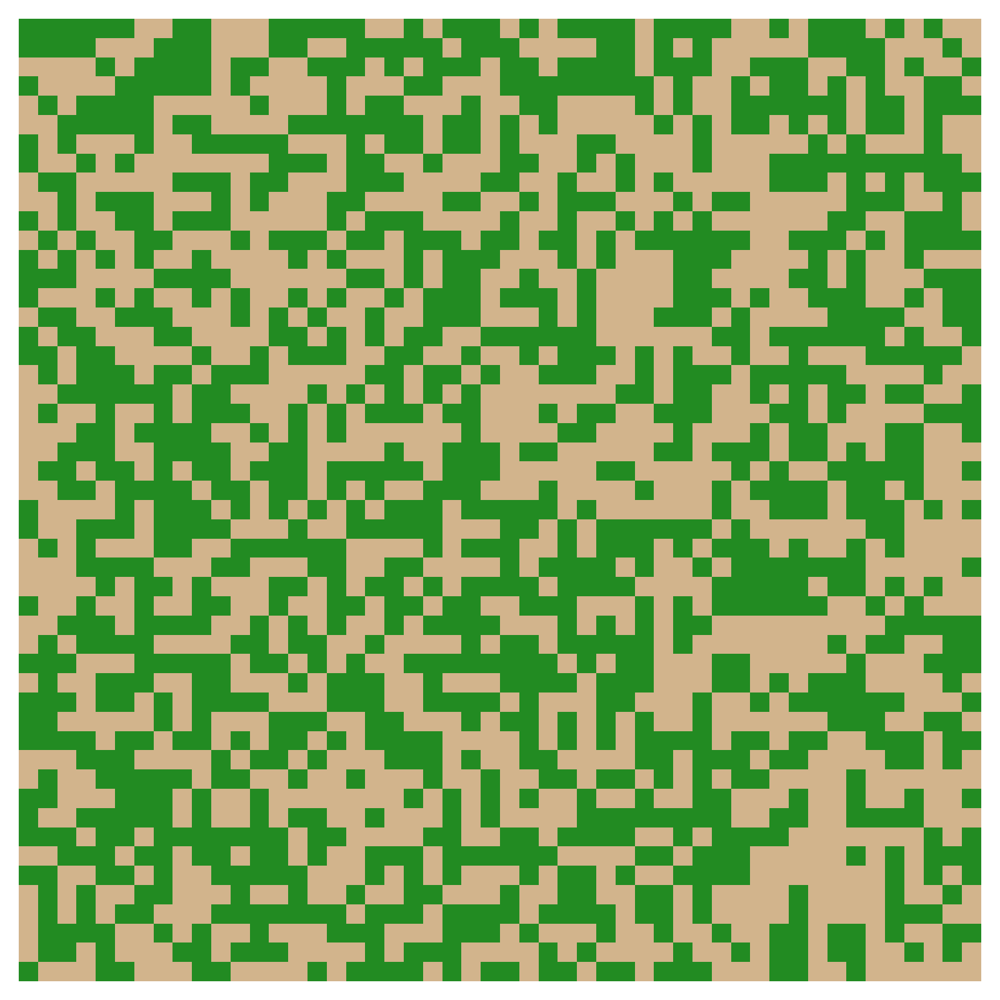

# ForestFire
Forest Fire model for Complex System Simulation course of the master Computational Science at UvA (2023).

## Problem formulation
Forest fires in Europe have significant impacts on vegetation and ecosystems. Different types of vegetation in Europe have varying degrees of proneness to wildfires. Europe's diverse ecosystems, ranging from Mediterranean shrublands to boreal forests, have distinct characteristics that influence their vulnerability to fire. Wildfires arise from natural and human causes, affecting biodiversity, altering ecosystems, and contributing to soil degradation. With climate change and the rise of more extreme weather (especially drought), forest fires start to occur more frequently. Therefore, it is important to understand the dynamics of fire spread for effective forest management, conservation, and the development of strategies to reduce the devastating effects of forest fires. 

In this case, simple simulation models, like cellular automata, are relevant in the context of studying forest fires and percolation for several reasons. For instance, they allow us to study the fire behaviour in a controlled environment. We can, for example, model how the fire spreads and interacts with different vegetation types and other external factors like wind and humidity. This provides us with a cost-effective and efficient way to investigate numerous possibilities and gather data that might be challenging or impractical to obtain through real-world experiments. Eventually, once a model is validated against real-world data, its findings can be used to apply in practice and make informed decisions in fire management policies. Moreover, the simulations can serve as an educational tool for studying characteristics of complex systems, like emergence, self-organized criticallity and percolation. 

Studying vegetation in particular, is important for understanding how climate, fire, and ecosystems work together. We can identify regional differences in fire patterns, prevent forest homogenization, help forests adapt, make better plans to manage fires, and predict what might happen in the future for smarter forest management. Therefore we decided to implement a simple cellular automata forest fire model, with a focus on critical percolation density of the forest and two different vegetation types. \
We define a 2D grid model and adhere to the percolation definition and critical percolation density defined by Christensen and Moloney (2005): 

<em>"By definition, a cluster is percolating if and only if it is infinite. Clearly, clusters that span a finite lattice from left to right or top to bottom are candidates for percolating clusters in infinite. ... In an infinite system, there exists a_ critical occupation probability, P<sub>c</sub> , such that for p < P<sub>c</sub> there is no percolating infinite cluster, while for p > P<sub>c</sub> there is a percolating infinite cluster."</em> 

Thus, with the model we focused on implementing functions to answer to following question: \
**How does the density and ratio of different vegetation types affect percolation in a forest fire model?**

## Model implementation
A grid is initially set up with plant cells based on a predetermined plant density. The proportion between trees, grass and shrubs (3 plant types), as well as the likelihood of ignition and the humidity for one plant type, can be adjusted. Once a cell is randomly ignited, the ignition probability of neighboring cells is calculated by taking into account the number of neighboring cells that are on fire, and the external factors (ignition probability and humidity). If a randomly generated value is lower than this ratio, the cell ignites.

### Rules and assumptions
- The forest is represented as a 2D grid.
- Each cell in the grid can have one of the following states: empty, plant, fire, or burned.
- The forest is initialized with a certain density of trees, which can be randomly distributed or follow a specific pattern.
- A single initial ignition event - 'lightning strike' - starts the wildfire.
- The fire spreads from burning cells to neighboring cells based on a neighborhood type (Moore or Von Neumann).
- The probability of a cell catching fire depends on the number of burning neighbors, the ignition probability of the vegetation type in the cell, and the humidity of the cell.
- The fire burns for a specified burnout time (simulation steps) before a tree cell transitions to the burned state.
- The simulation continues until all fires are extinguished.
- No regrowth of trees because the growth timescales are much greater than the wildfire time scales.

#### Fire chance
`chance_fire = total neighbours on fire / total neighbours * ignition * humidity`

## Structure of the repository
* Code filemap: The code filemap contains all of the scripts of the model, experiments and plots.
* Output filemap: json files generated from the experiments will be saved here, as well as the animation GIFs.
* Plots filemap: plots generated from experimenets will be saved here.

```
.
├── Code    
│     ├── Output
│     └── Plots
├── .gitignore
├── main.py
├── README.md
└── requirements.txt
```
## Getting started
### Prerequisites
This program is fully written in [Python (3.11.0)](https://www.python.org/downloads/) and to run the code you will need some dependencies that can be installed with the following line of code:

`pip install -r requirements.txt`

### Usage
The model can be run with the following command:

`python main.py [mode] [arguments]`

Replace `[mode]` with one of the following modes:

- `test`: Runs a test simulation of the forest fire model.
- `crit_p`: Performs a density experiment to evaluate the percolation probability for varying densities, and determine the critical density for forest fire propagation.
- `burn_area`: Conducts an experiment to measure the burned area over time for varying densities.
- `igni_ratio_2`: Generates a heatmap to analyze the percolation of fire based on plant ratios (trees/shrubs) and varying shrub ignition probabilities.

Provide additional arguments based on the chosen mode. The available arguments are as follows:

- `--dimension [value]`: Specifies the dimension of the grid (integer value).
- `--density [value]`: Sets the density of plants in the forest (float value).
- `--burnup [value]`: Specifies the fire burnout time (integer value).
- `--veg_ratio [tree] [grass] [shrub]`: Sets the ratio of vegetation types in the grid (float values, summing up to 1).

Example:\
`python main.py test random --dimension 100 --density 0.8 --burnup 10 --veg_ratio 0.4 0.3 0.3 `



### Vectorized parallel version for the forest density / plant ratio experiment
#TODO

## Authors
- [@sedadenboer](https://github.com/sedadenboer)
- [@Alex-notmyname](https://github.com/Alex-notmyname)
- [@AkjePurr](https://github.com/AkjePurr)
- [@reinoutmensing](https://github.com/reinoutmensing)

## References
Christensen, K., & Moloney, N. R. (2005). <em>Complexity and Criticality<em>. Imperial College Press.
